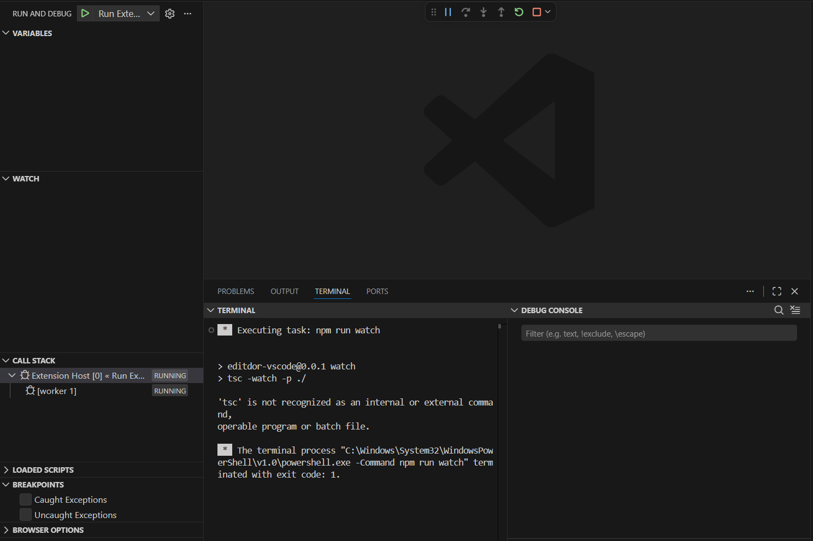
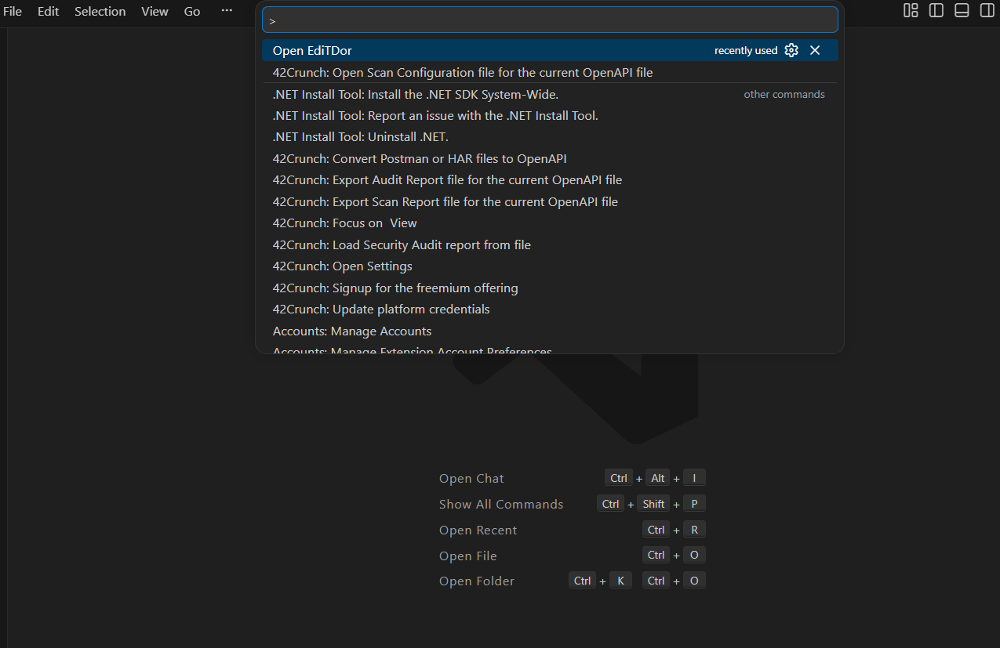
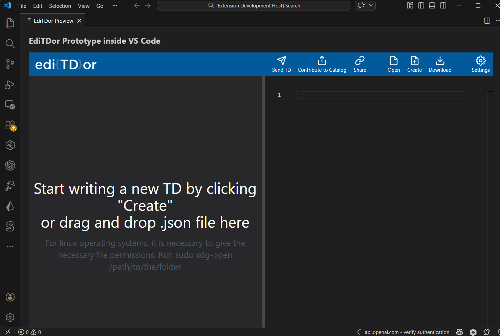

# EdiTDor VS Code Prototype

This repository contains a prototype VS Code extension demonstrating how **EdiTDor can be integrated into the VS Code environment using a WebView panel**.

## Features

* VS Code command: **Open EdiTDor**
* WebView panel integration
* EdiTDor editor embedded inside VS Code

## Running the Prototype

Clone the repository:

```
git clone https://github.com/Pranav-0440/editdor-vscode-prototype
cd editdor-vscode-prototype
npm install
```

Open in VS Code and press **F5** to run the extension.



A new window opens called:
```
Extension Development Host
```

Then open the command palette:

```
Ctrl + Shift + P
```

Run:

```
Open EdiTDor
```


This opens the EdiTDor interface inside a VS Code WebView.



## Motivation

This prototype explores the feasibility of integrating the EdiTDor Thing Description editor into developer environments such as VS Code.
